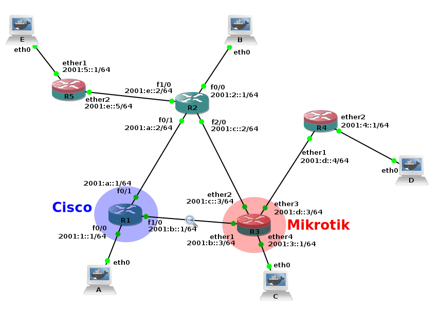

OSPF
====

Open Shortest Path First.

- Se puede dividir en áreas, cada router sabe solamente los caminos dentro de su
  área, después sabe un resumen de las demás areas pero nada más.

- Cada router tiene un ID de 24 bits, por defecto es la IP de una interfaz de
  loopback. De lo contrario se usa una IP de alguna interfaz pero puede traer
  problemas si esa interfaz se cae.

- Usa el algoritmo Dijkstra.

- La métrica depende de la implemetación de cada dispositivo. Por ejemplo
  ``costo = 10^8 / Ancho de banda en bits/s``.

- El camino entre dos áreas siempre pasa por el area 0, salvo que se haga un
  camino virtual.

- OSPFv2 se usa para IPv4 mientras que OSPFv3 para IPv6.

- Utiliza multicast, va sobre IP.

- Intercambia información durante descubrimiento y cuando hay cambios. Cuando
  la red está estable sólo envía mensajes "Hello" para avisar que el enlace está
  activo.

- Se pueden definir áreas, para viajar entre dos áreas generalmente los paquetes
  pasan por el área 0 o backbone. Las demás areas son *Stub* o de tránsito.

- Las áreas de tránsito funcionan haciendo un enlace virtual entre sus
  extremos, es como que de esa forma extienden el área 0.

- Los dispositivos no conocen la topología de las otras áreas.

- Si hay varios routers en una red de difusión, el que tenga un router-id mayor
  va a actuar como router designado. El router de backup es el que tenga el
  segundo mayor router-id.

- Cada router tiene una LSDB (Link State Database), una base de datos con
  información de los estados de los enlaces. La base de datos está compuesta por
  LSAs (Link State Advertisements).

Dijkstra
--------

Es el algoritmo que usa OSPF para determinar el mejor camino.

- Primero cada router descubre su topología local.

- Después se hace una inundación de la red con información del estado de cada
  router y de sus enlaces. Se llama LSA (Link State Advertising).

- Luego cada router construye un grafo de toda la red para buscar los mejores
  caminos.

- Finalmente cada router construye su tabla de ruteo.

- A diferencia del algoritmo de vector-distancia:

  - Se intercambian estados de enlace en lugar de tablas de ruteo.

  - Se envía la información a todos los routers en lugar de enviar a sólo los
    vecinos.

  - La convergencia es más rápida, hay menor carga en la red pero se necesita
    una capacidad de procesamiento mayor.

Tipos de LSAs
-------------

Los LSAs (Link State Advertisements) son pedazos de información que permiten
saber el estado de la red. Los routers se envían los LSAs entre sí y los guardan
en una LSDB (Link State Database). Pongo solamente cuatro para dar una idea.

- Router LSA, tipo 1: Cada router crea un LSA tipo 1 que contiene el router ID
  y estados de enlaces con sus métricas. Estos LSAs son enviados y se propagan
  por toda una área. Terminan caracterizando los enlaces punto a punto entre
  routers.

- Network LSA, tipo 2: El router designado lista a los routers unidos en un
  mismo segmento (pueden ser más de 2 si es un medio de difusión). Se propagan
  por toda un área. Terminan caracterizando los enlaces por un medio de
  difusión.

- Summary LSA, tipo 3: Un router de borde toma información aprendida desde la
  otra área y provee un sumario de esa área.

- External LSA, tipo 5: Contienen información proveniente de otros procesos de
  ruteo. Se propagan en todas las áreas sin cambios (menos hacia las áreas
  stub).

Tipos de paquetes
-----------------

- HELLO: Se usa para mantener activa la conexión con los routers vecinos.
  También se usa para encontrar el router designado si se está en una red de
  difusión.

- DBD (Database Description): Envía información sobre la base de datos LSDB,
  trata sobre el estado de los enlaces adyacentes. Si es mucha información se
  separa en varios paquetes.

- LSR (Link State Request): Solicita información sobre el estado de un enlace.

- LSU (Link State Update): Es una respuesta a las peticiones LSR aunque también
  se envían por broadcast/multicast regularmente. Contiene información sobre el
  estado de enlaces (LSAs).

- LSAck (Link State Acknowlegment): Indica que se ha recibido un LSU.

OSPFv3
------

Captura
~~~~~~~

En la foto se pueden ver los Cisco (routers azules), Mikrotik (routers azules y
rojos) y el punto de captura (la lupa). En la captura se ven los paquetes OSPF
que se envían entre el Mikrotik encerrado con rojo (R3) y el Cisco encerrado en
azul (R1)

Rutas del Cisco::

  IPv6 Routing Table - 15 entries
  Codes: C - Connected, L - Local, S - Static, R - RIP, B - BGP
         U - Per-user Static route
         I1 - ISIS L1, I2 - ISIS L2, IA - ISIS interarea, IS - ISIS summary
         O - OSPF intra, OI - OSPF inter, OE1 - OSPF ext 1, OE2 - OSPF ext 2
         ON1 - OSPF NSSA ext 1, ON2 - OSPF NSSA ext 2
  C   2001:1::/64 [0/0]
       via ::, FastEthernet0/0
  L   2001:1::1/128 [0/0]
       via ::, FastEthernet0/0
  OE2  2001:2::/64 [110/20]
       via FE80::C602:AFF:FE0D:1, FastEthernet0/1
  O   2001:3::/64 [110/11]
       via FE80::E45:23FF:FEEE:A300, FastEthernet1/0
  O   2001:4::/64 [110/21]
       via FE80::E45:23FF:FEEE:A300, FastEthernet1/0
  O   2001:5::/64 [110/21]
       via FE80::C602:AFF:FE0D:1, FastEthernet0/1
  C   2001:A::/64 [0/0]
       via ::, FastEthernet0/1
  L   2001:A::1/128 [0/0]
       via ::, FastEthernet0/1
  C   2001:B::/64 [0/0]
       via ::, FastEthernet1/0
  L   2001:B::1/128 [0/0]
       via ::, FastEthernet1/0
  O   2001:C::/64 [110/11]
       via FE80::E45:23FF:FEEE:A300, FastEthernet1/0
       via FE80::C602:AFF:FE0D:1, FastEthernet0/1
  O   2001:D::/64 [110/11]
       via FE80::E45:23FF:FEEE:A300, FastEthernet1/0
  O   2001:E::/64 [110/11]
       via FE80::C602:AFF:FE0D:1, FastEthernet0/1
  L   FE80::/10 [0/0]
       via ::, Null0
  L   FF00::/8 [0/0]
       via ::, Null0

Rutas de R3::

  Flags: X - disabled, A - active, D - dynamic, C - connect, S - static, r - rip, o - ospf, b - bgp, U - unreachable
   #      DST-ADDRESS              GATEWAY                  DISTANCE
   0 ADo  2001:1::/64              fe80::c601:9ff:fe68:1...      110
   1 ADo  2001:2::/64              fe80::c602:aff:fe0d:2...      110
   2 ADC  2001:3::/64              ether4                          0
   3 ADo  2001:4::/64              fe80::e45:23ff:fee7:3...      110
   4 ADo  2001:5::/64              fe80::c602:aff:fe0d:2...      110
   5 ADo  2001:a::/64              fe80::c601:9ff:fe68:1...      110
                                   fe80::c602:aff:fe0d:2...
   6 ADC  2001:b::/64              ether1                          0
   7 ADC  2001:c::/64              ether2                          0
   8 ADC  2001:d::/64              ether3                          0
   9 ADo  2001:e::/64              fe80::c602:aff:fe0d:2...      110

Se puede ver que todas las rutas están bien, también comprobé que se puede legar
con ping a todos lados.

.. todo:: Intentar entender las capturas del Wireshark

Referencias
-----------

- https://tutorzine.com/ospf-lsa-types/

- https://en.wikipedia.org/wiki/Link-state_advertisement

- https://networklessons.com/ospf/ospf-lsa-types-explained
